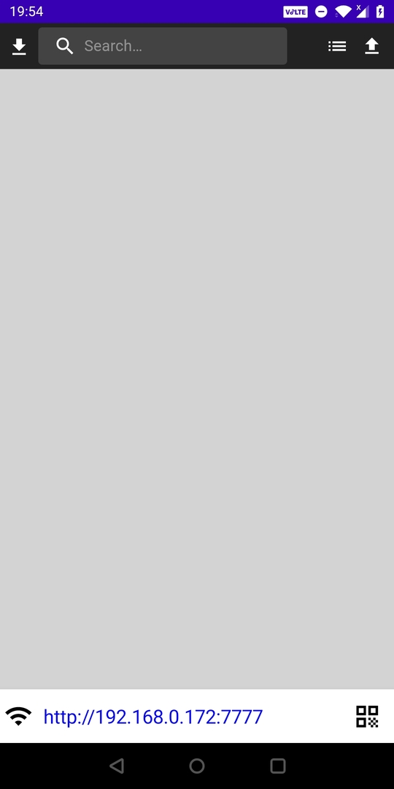
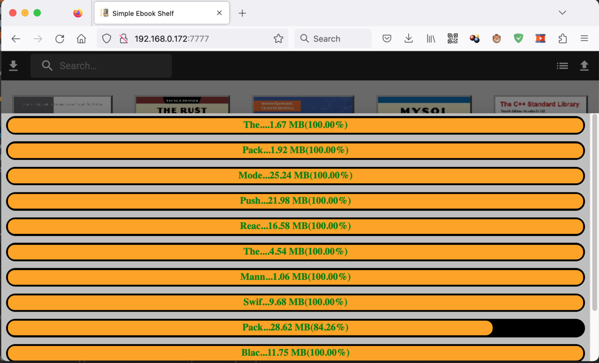
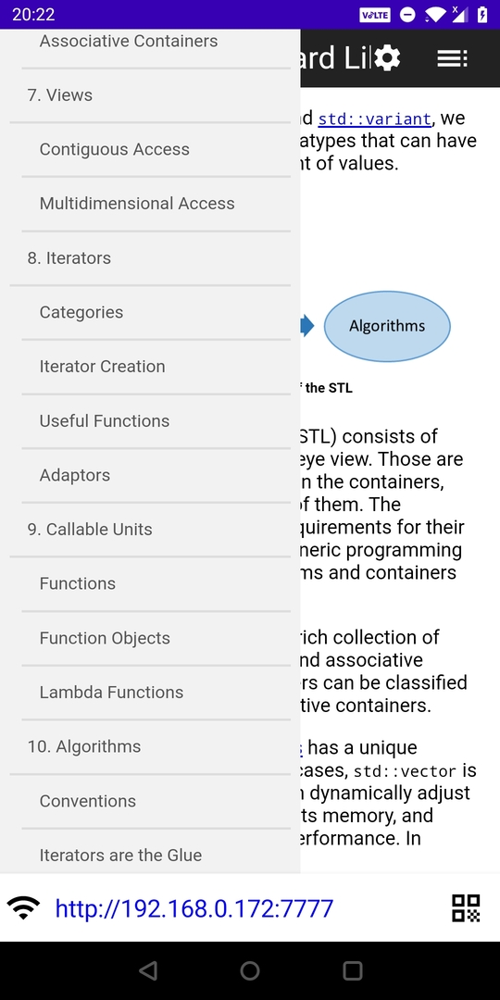
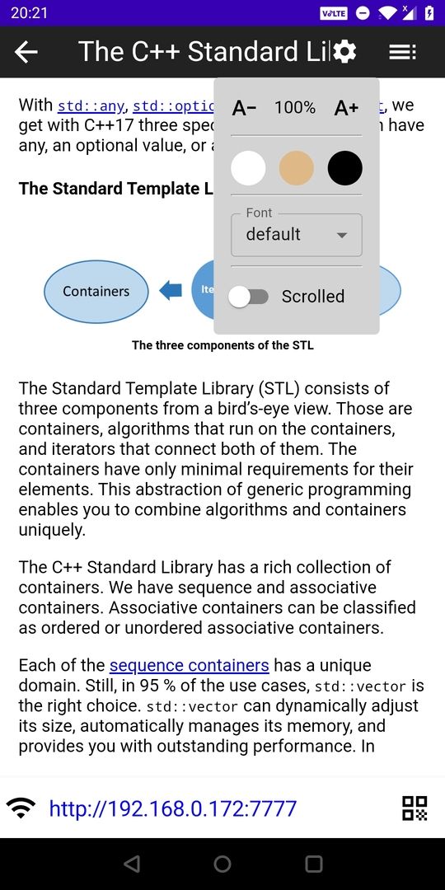
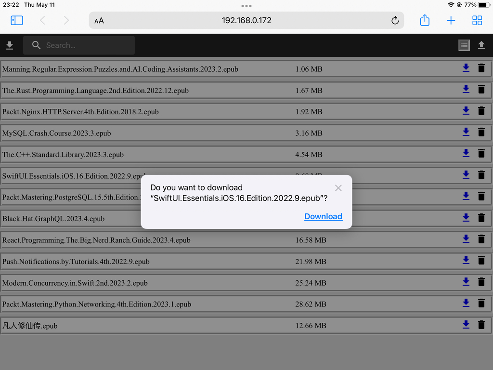

# Epub file reader app

## Features: 

1. Embedded http server(with reactjs spa ui), so natively enable upload/download ebooks via wifi

    For reference: [App backend performance](app-backend-performance.md)

2. Embedded custom fonts that can be switched between
3. Enable family/friends read packs of books on your phone or raspberry pi at the same time, with different progress?

## Limitation:

Can only read epub format, thanks to epubjs 

## Known issue:

Restore last reading location may drift, i.e. not return to exact the same page when last left off

There are open issues:

- https://stackoverflow.com/questions/58796059/epub-js-rendition-display-does-not-work  
- https://github.com/futurepress/epub.js/issues/895  

# Typical Usages

1. Open app on raspberry pi or mobile device
2. Use laptop/desktop browser upload packs of books to the device via wifi
3. Start reading or sharing books  
*in the case of mobile sharing, leave it run on foreground, even better, plug in charger*
4. Optionally, download books from ebook app on other devices within intranet

    
 
        <h2>Open app on android, started with empty shelf</h2>
        
    

    
 
        <h2>Upload books from macbook(or any other node in the same intranet)</h2>
        
    

    
 
        <h2>Books show in app book shelf</h2>
        
    

    
 
        <h2>Show app address qrcode</h2>
        
    

    
 
        <h2>Iphone scan this qrcode, and open the spa app in safari</h2>
        
    

    
 
        <h2>Show book content</h2>
        
    

    
 
        <h2>Show book settings</h2>
        
    

    
 
        <h2>Read chinese book with lishu(隶书) font, which embedded in app</h2>
        
    

    
 
        <h2>Download(or delete) epub file on another ipad</h2>
        
    

